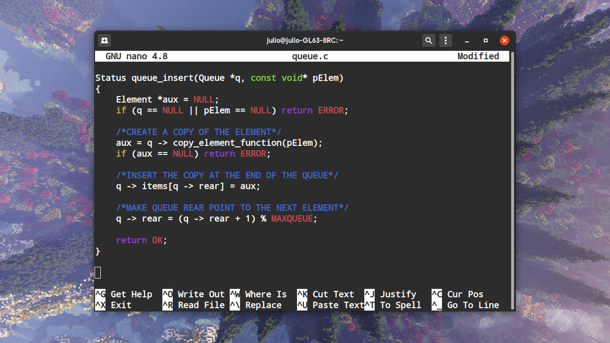

# Conflux Alacritty

Conflux color theme for Alacritty.

  DESCRIPTION
 
 This color palette was inspired by the crimson editor
 gedit theme by Dan VanMullen. All 8 colors are equally distributed 
 among the hue wheel, illustrating the armonious consonance of nature 
 and programming.

  INSTALLATION

Place the "alacritty.yml" file inside the .config folder of your home directory.
If you already have a config file, append the contents of this file
to it to preserve your previous settings.

  LICENSING

 This library is free software; you can redistribute it and/or
 modify it under the terms of the GNU Library General Public
 License as published by the Free Software Foundation; either
 version 2 of the License, or (at your option) any later version.

 This library is distributed in the hope that it will be useful,
 but WITHOUT ANY WARRANTY; without even the implied warranty of
 MERCHANTABILITY or FITNESS FOR A PARTICULAR PURPOSE. See the GNU
 Library General Public License for more details.

 You should have received a copy of the GNU Library General Public
 License along with this library; if not, write to the
 Free Software Foundation, Inc., 59 Temple Place - Suite 330,
 Boston, MA 02111-1307, USA.
 
  CONTACT
 
 Julio Cabria - julicabria@outlook.com
 Official Website - https://conflux.carrd.co/
 GitHub - https://github.com/Julynx/conflux_alacritty

